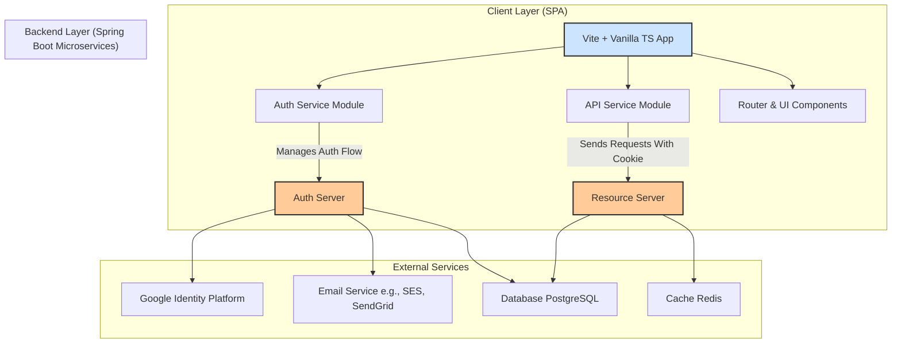

# **Project Introduction**

**Project Name:** LinkForge

**Vision:** To build a robust, secure, and user-friendly platform for comprehensive link management, offering services beyond simple shortening. LinkForge aims to be a one-stop solution for individuals, content creators, and enterprises to manage their digital footprint, enhance engagement through custom landing pages, and integrate powerful link analytics into their workflows.

**Core Features:**
*   **URL Shortening:** Create memorable, short links from long URLs.
*   **QR Code & Barcode Generation:** Generate and manage dynamic QR codes and barcodes linked to your shortened URLs.
*   **Custom Landing Pages:** Build and customize landing pages for marketing campaigns, complete with tracking.
*   **Analytics Dashboard:** View detailed click-through rates, geographic data, referral sources, and device information.
*   **Enterprise API:** A full-featured REST API for programmatic management of links and assets, enabling integration into other business systems.
*   **User Management:** Secure registration, authentication, and profile management.

---

## **System Architecture & Components**

This architecture is designed for security, scalability, and a clean separation of concerns.

#### **1. Client Application (SPA - Single Page Application)**
*   **Technology:** Vite + Vanilla TypeScript.
*   **Responsibility:** Provides the entire user interface. It is a static bundle of HTML, CSS, and JS served from a simple web server (like Nginx) or a CDN.

**Key Client-Side Modules:**
*   **Auth Service:** A central TypeScript service (using **Axios**) responsible for all interactions with the Auth Server.
    *   Initiates the OAuth2 flow with Google (redirects to Auth Server).
    *   Handles traditional login/registration forms via Axios calls.
    *   Manages the silent token refresh process (using a hidden iframe or an Axios call to the Auth Server's `/refresh` endpoint).
*   **API Service:** A dedicated Axios instance configured for all communication with the Resource Server.
    *   Pre-configured with `withCredentials: true` to ensure the HttpOnly access token cookie is automatically sent with every request.
    *   Uses **Axios Response Interceptors** to elegantly handle `401` responses with the `WWW-Authenticate: Refresh` header. It triggers the `Auth Service` to get a new token and automatically retries the original request.
*   **State Management (Zustand):** A centralized store to manage global application state.
    *   **Auth Store:** Tracks authentication state (`isAuthenticated`), user profile claims, and loading states.
    *   **UI Store:** Manages client-side state like modal visibility, notifications, and theme preferences.
    *   **Data Store:** (Optional) Can cache data like the user's list of links to share across components.
*   **Router (Navigo):** A lightweight and powerful client-side router. It handles navigation between different application "views" (e.g., Dashboard, Login, Analytics) without full page reloads, mapping routes to specific rendering functions.
*   **UI Components (Custom Library):** A suite of reusable, pre-built TypeScript/Web Component classes or functions for creating dynamic and consistent UI elements (buttons, modals, tables, forms, charts). This library provides the foundational building blocks for the entire application interface.

#### **2. Authentication Server (Spring Boot Application)**
*   **Technology:** Spring Boot, Spring Security, Spring Data JPA, OAuth2 Client/Resource Server.
*   **Responsibility:** The central hub for all identity and access management. It is the only system that issues tokens.

**Key Endpoints & Features:**
*   **OAuth2 Federation:** `/oauth2/authorization/google` - Initiates the login flow with Google.
*   **Traditional Auth Endpoints:**
    *   `POST /api/auth/register` - User registration.
    *   `POST /api/auth/login` - Traditional login (username/password).
    *   `POST /api/auth/refresh` - Issues a new access token using a valid refresh token. **Must be callable from an iframe (CORS configured).**
    *   `POST /api/auth/logout` - Logs the user out and clears the cookies.
*   **User Management Endpoints:**
    *   `GET /api/auth/confirm-account` - Email confirmation.
    *   `POST /api/auth/forgot-password` - Initiates password reset.
    *   `POST /api/auth/reset-password` - Completes password reset.
    *   `POST /api/auth/resend-verification` - Resends verification email.
*   **Token Issuance:** Upon successful authentication (via Google or traditional login), it sets two **secure, HTTP-only, same-site** cookies in the response:
    *   `access_token`: A signed JWT containing user claims (e.g., `sub`, `email`, `roles`). Short-lived (e.g., 5-15 minutes).
    *   `refresh_token`: An opaque token stored in the database. Longer-lived (e.g., 7 days).

#### **3. Resource Server (Spring Boot Application)**
*   **Technology:** Spring Boot, Spring Security (OAuth2 Resource Server), Spring Data JPA.
*   **Responsibility:** Serves all business data and functionality. It is completely unaware of login mechanisms; it only validates the JWT access token.

**Key Features & Endpoints:**
*   **Security:** Configured to validate the JWT `access_token` cookie on every incoming request. It uses the Auth Server's public key to verify the token's signature.
*   **Business Endpoints:**
    *   `GET /api/links` - Get user's shortened links.
    *   `POST /api/links` - Create a new short link.
    *   `GET /api/analytics/{linkId}` - Get analytics for a link.
    *   `POST /api/qrcodes` - Generate a QR code.
    *   `GET /api/enterprise/**` - Enterprise API endpoints.
*   **Token Refresh Handling:** If a token is expired, it returns a `401 Unauthorized` status with a clear header: `WWW-Authenticate: Refresh`. This is a signal to the SPA's `API Service` interceptor that it needs to refresh the token.

#### **4. Data Store & External Services**
*   **Primary Database (PostgreSQL):** Stores user data (Auth Server), links, QR codes, analytics data (Resource Server).
*   **Cache (Redis):** Used by the Resource Server for caching frequently accessed short codes -> original URL mappings for ultra-fast redirection and rate-limiting.
*   **Email Service (AWS SES/SendGrid):** Integrated with the Auth Server for sending account confirmation, password reset emails, etc.
*   **Google Identity Platform:** The external IdP for federated login.

---

### **Detailed Tech Stack**

| Layer | Component | Technology | Justification |
| :--- | :--- | :--- | :--- |
| **Build Tool** | Vite | Vite | Blazing fast development server (HMR) and optimized builds for production. Perfect for Vanilla TS. |
| **Client-Side** | Language | TypeScript | Adds static typing, reducing runtime errors and improving developer experience and tooling. |
| | HTTP Client | **Axios** | Superior to native `fetch` for interceptors, automatic JSON transformation, and better error handling. **Critical for auth flow.** |
| | State Management | **Zustand** | Lightweight, un-opinionated, and simple API. Perfect for managing global state (auth, UI) in a Vanilla TS app. |
| | Routing | **Navigo** | A simple, powerful, and lightweight client-side router that integrates well without a framework. |
| | UI Components | **Custom Library** | Provides full control over branding, functionality, and user experience. Reusable across the application. |
| **Auth Server** | Framework | Spring Boot (Java 17+) | Industry standard, excellent Spring Security support for OAuth2 and JWT. |
| | Security | Spring Security OAuth2 | Provides a robust, secure, and customizable framework for implementing the auth server. |
| | Token Format | JWT (JSON Web Tokens) | Stateless, self-contained, and easily verifiable by the Resource Server. |
| **Resource Server** | Framework | Spring Boot (Java 17+) | Consistency with Auth Server, strong ecosystem. |
| | Security | Spring Security OAuth2 Resource Server | Simplifies JWT validation and endpoint protection. |
| | Data Access | Spring Data JPA / Hibernate | Simplifies database interactions. |
| **Database** | Primary DB | PostgreSQL | Powerful, open-source, relational database with strong performance and JSON support. |
| | Cache | Redis | In-memory data store for high-speed caching of URLs and session data. |
| **Infrastructure** | Deployment | Docker & Docker Compose (Dev) | Containerization for easy local development and environment consistency. |
| | Production | Kubernetes / AWS ECS (Prod) | Orchestration for scaling the backend services independently. |
| | Hosting (SPA) | AWS S3 + CloudFront / Netlify | Global CDN for serving the static SPA assets with low latency. |
| **Others** | Email | AWS SES / SendGrid | Reliable and scalable transactional email services. |
| | External IdP | Google Identity Platform | User-friendly, trusted, and widely adopted social login. |

---

### **Security Considerations**

1.  **Cookie Attributes:** The `access_token` and `refresh_token` cookies **must** be set with:
    *   `HttpOnly=true` (inaccessible to JavaScript, preventing XSS theft).
    *   `Secure=true` (only sent over HTTPS).
    *   `SameSite=Lax` or `Strict` (prevents CSRF attacks). `Lax` is often needed for OAuth redirects.
    *   `Path=/refresh` (especially for the refresh token cookie to limit its scope).
2.  **CORS:** The Auth and Resource servers must be configured with proper CORS headers to only allow requests from the SPA's domain.
3.  **JWT Signing:** The Auth Server must use a strong RSA key pair to sign JWTs. The Resource Server must have the public key to verify them.
4.  **Refresh Token Endpoint:** The `/refresh` endpoint must be protected against CSRF. Using the `SameSite` cookie attribute is the primary defense. Spring Security provides built-in protection here.
5.  **Silent Refresh (Iframe):** The Auth Server's `/refresh` endpoint must send the header `X-Frame-Options: SAMEORIGIN` (or be configured to allow embedding in an iframe from your SPA's domain) to work correctly.

This architecture provides a solid, secure, and scalable foundation for your LinkForge application.

---

### **Functional Deep Dives**

This document provides a high-level overview. For detailed sequence diagrams, API specifications, and logic flows for each core functionality, please refer to the following dedicated pages:

*   **[Authentication & Authorization Workflow](./docs/Authentication_Workflow.md)**: The complete end-to-end flow for user registration, login (traditional and Google OAuth), token issuance, silent refresh, and logout.
*   **[URL Shortening Flow](./URL_Shortening_Flow.md)**: The process of creating a new short link, from the UI request through to saving in the database and caching in Redis.
*   **[Link Redirection Flow](./Link_Redirection_Flow.md)**: The high-performance flow for resolving a short code to a full URL, involving cache checks, analytics logging, and redirects.
*   **[QR Code Generation & Management](./QR_Code_Flow.md)**: The workflow for generating, storing, and retrieving QR codes associated with shortened links.
*   **[Analytics Data Processing](./Analytics_Workflow.md)**: How click events are captured, processed, stored, and served to the analytics dashboard.
*   **[Silent Token Refresh Mechanism](./Silent_Refresh_Flow.md)**: A detailed look at the automatic token renewal process using Axios interceptors and the Auth Server's refresh endpoint.

---
