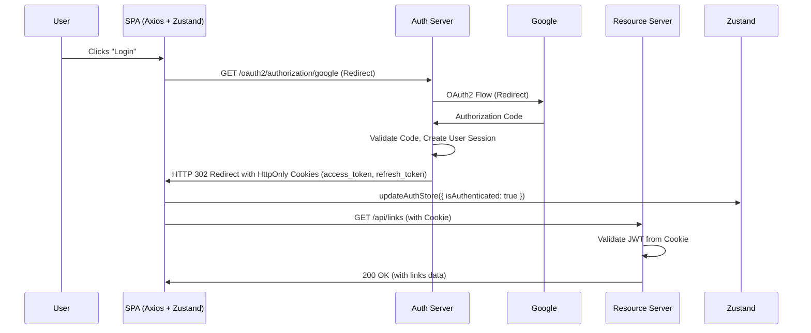

# Authentication & Authorization Workflow

## Overview
This document details the complete authentication flow for LinkForge, covering traditional login, Google federated login, token refresh, and logout.

## Sequence Diagram



## Traditional Login Flow
1.  **UI Form Submission:** User fills in username/password in a custom UI component.
2.  **Axios Call:** The `auth.service.ts` uses Axios to `POST` credentials to `/api/auth/login`.
3.  **Server Response:** Auth Server validates credentials, generates tokens, and sets them as HttpOnly cookies.
4.  **State Update:** On a successful response, the Axios interceptor calls the Zustand auth store to update the global `isAuthenticated` state.
5.  **Navigation:** The Navigo router is triggered to redirect the user to the dashboard.

## Silent Token Refresh Flow
1.  **Expired Token Request:** The SPA sends a request to the Resource Server with an expired access token.
2.  **401 Response:** The Resource Server responds with `401 Unauthorized` and `WWW-Authenticate: Refresh`.
3.  **Axios Interceptor:** The response interceptor in `api.client.ts` catches the 401.
4.  **Refresh Call:** The interceptor calls `auth.service.refreshToken()`, which uses a hidden iframe or Axios to call `POST /api/auth/refresh`. The refresh token cookie is sent automatically.
5.  **New Tokens:** The Auth Server validates the refresh token and issues new access/refresh tokens via cookies.
6.  **Request Retry:** The interceptor automatically retries the original request to the Resource Server with the new access token.

## Logout Flow
1.  **User Action:** User clicks "Logout" in the UI.
2.  **Server Call:** `auth.service.ts` calls `POST /api/auth/logout`.
3.  **Server Clears Cookies:** Auth Server invalidates the refresh token and responds with headers to clear the access and refresh token cookies.
4.  **Client-State Clear:** The Zustand auth store is reset to its initial state (`isAuthenticated: false, user: null`).
5.  **UI Redirect:** The client router redirects to the login page.
```

