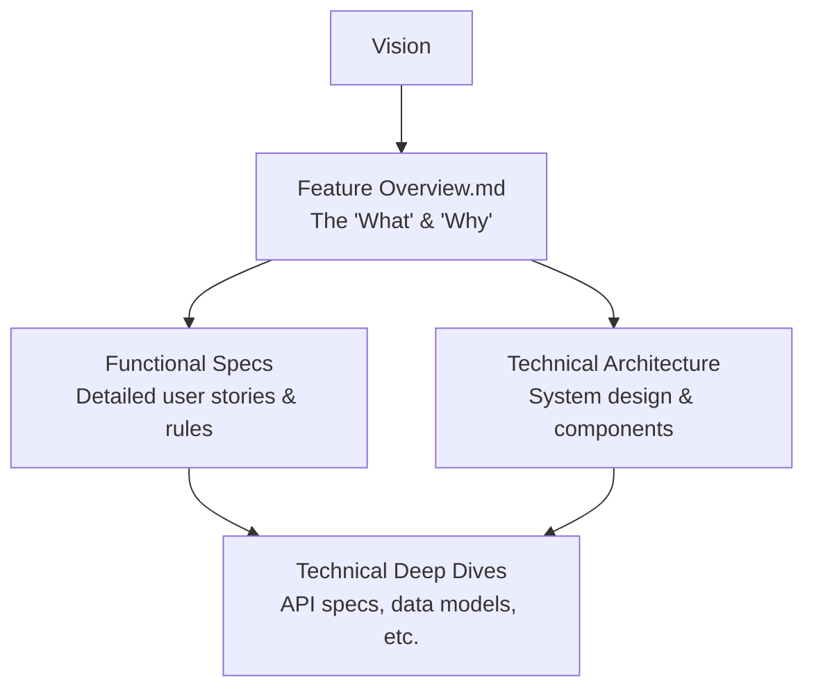

# LinkForge - Feature Overview

## 1. Vision & Core Value Proposition
A robust, secure, and user-friendly platform for comprehensive link management, offering services beyond simple shortening. LinkForge is the one-stop solution for individuals, content creators, and enterprises to manage their digital footprint, enhance engagement, and integrate powerful analytics.

## 2. Target Users
1.  **Content Creators & Social Media Managers:** Who need to track engagement and create memorable links.
2.  **Marketing Teams:** Who run campaigns and need custom landing pages with detailed analytics.
3.  **Developers & Enterprises:** Who require a reliable API to integrate link management into their own systems and workflows.

## 3. Core Features

### 3.1. Unified User Management & Authentication
*   **Description:** A secure, centralized system for users to access all LinkForge features.
*   **Key Functionalities:**
    *   Traditional Email & Password registration and login.
    *   Federated Login via Google OAuth.
    *   Email verification for new accounts.
    *   Secure password reset flow.
    *   User profile management.

### 3.2. Intelligent URL Shortening
*   **Description:** The core service of creating short, trackable links from long URLs.
*   **Key Functionalities:**
    *   Instant generation of a random short code.
    *   Option to set a custom, memorable alias (e.g., `lnkf.ge/myshop`).
    *   Validation to ensure custom aliases are unique.
    *   Copy shortened link to clipboard with one click.

### 3.3. QR Code & Barcode Generation
*   **Description:** Create dynamic QR codes and barcodes linked directly to shortened URLs.
*   **Key Functionalities:**
    *   Generate QR codes in various formats and styles.
    *   Download QR codes as PNG or SVG files.
    *   Manage a history of all generated codes.

### 3.4. Custom Landing Page Builder
*   **Description:** allows users to create and customize lightweight landing pages for their marketing campaigns.
*   **Key Functionalities:**
    *   Drag-and-drop or form-based editor for adding elements (text, images, buttons).
    *   Assign a shortened link to a landing page.
    *   Track visits and conversions specifically for each landing page.

### 3.5. Comprehensive Analytics Dashboard
*   **Description:** provides detailed insights into link performance.
*   **Key Functionalities:**
    *   View total clicks, over time (charts).
    *   See geographic location of users.
    *   Identify referral sources and device types.
    *   Access data for individual links or aggregate reports.

### 3.6. Enterprise-Grade REST API
*   **Description:** A full-featured API for programmatic management of all LinkForge assets.
*   **Key Functionalities:**
    *   Create, read, update, and delete links via API calls.
    *   Generate QR codes programmatically.
    *   Retrieve analytics data in JSON format.
    *   Secure API key authentication and rate limiting.

---

## 4. How This Document Connects to Other Docs

This **Feature Overview** is the top of the documentation pyramid. It defines the **"What"** and the **"Why."**

*   **It informs the Functional Specifications:**
    *   The feature "QR Code Generation" in this document becomes a detailed functional spec in `/docs/functional/qr-codes.md`, describing the exact user interactions and UI rules.

*   **It informs the Technical Architecture:**
    *   The feature "Enterprise-Grade REST API" directly justifies the need for a robust **Resource Server** and **API Service** module described in `technical/architecture-overview.md`.

*   **It is informed by the Vision:**
    *   The vision statement ("one-stop solution") is the reason these six specific features are bundled together in a single product.

You can visualize the relationship like this:

