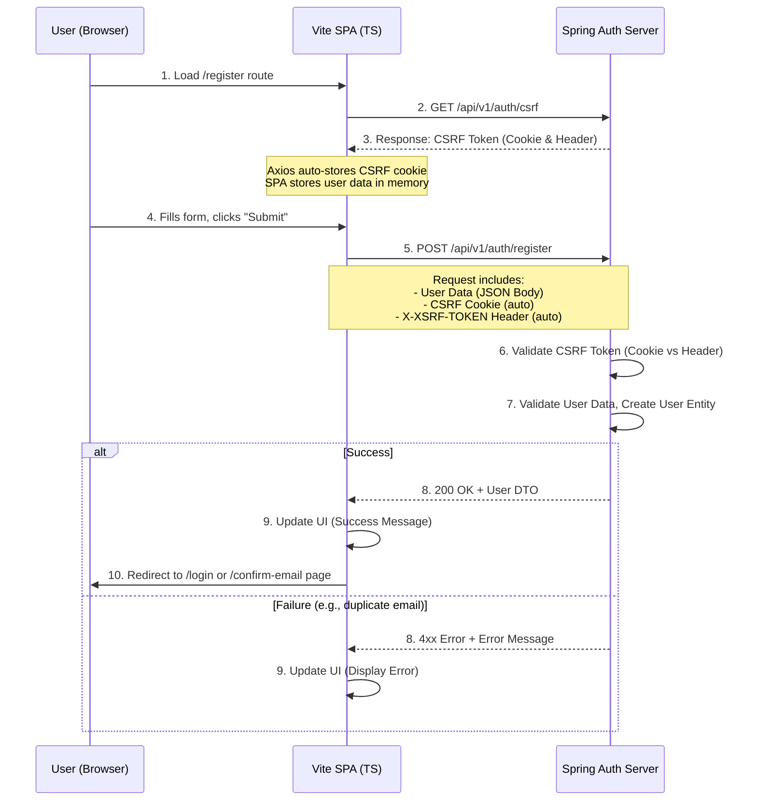

Implementing registration with a separate, cookie-based auth server requires careful handling of the CSRF token flow. Here is a detailed, step-by-step workflow for the registration process between your Vite SPA and the Spring Auth Server.

### High-Level Registration Workflow

The process involves two main sequential calls from the SPA to the Auth Server:
1.  **GET `/api/v1/auth/csrf`**: To fetch a fresh CSRF token.
2.  **POST `/api/v1/auth/register`**: To submit the user's registration data, including the CSRF token for validation.

The following sequence diagram visualizes this interaction:


Now, let's break down each step in detail.

---

### Detailed Step-by-Step Explanation

#### Step 1: User Navigates to the Registration Page
*   **SPA (Vite + TS):** The user clicks a "Register" link. Your **Navigo** router handles this, matching the `/register` path and executing a callback function.
*   **Action:** This callback function renders your custom UI components to display the registration form (e.g., name, email, password fields).

#### Step 2: SPA Fetches a CSRF Token
*   **Why?** The auth server protects state-changing endpoints (like `/register`, `/login`, `/logout`) from Cross-Site Request Forgery (CSRF) attacks. The SPA must prove that it originated the request by presenting a token it previously fetched.
*   **SPA (Vite + TS):** Before the form is even submitted, or immediately when the `/register` component mounts, your code makes a crucial initial call:
    ```typescript
    // Example using Axios in a `registerView.ts` component
    import { apiClient } from '../api/client'; // Your configured Axios instance

    async function initializeRegistration() {
      try {
        // This call is necessary to get the CSRF cookie set for the subsequent POST.
        await apiClient.get('/auth/csrf');
        // Now the browser automatically stores the CSRF cookie sent in the response.
      } catch (error) {
        // Handle error (e.g., show a message that the form is unavailable)
        console.error("Could not initialize registration:", error);
      }
    }
    // Call this function when the registration view is created.
    initializeRegistration();
    ```

#### Step 3: Auth Server Responds with CSRF Token
*   **Auth Server (Spring):** The `GET /api/v1/auth/csrf` endpoint generates a new CSRF token.
*   **Response:** The server sends the token in two ways:
    1.  **A Cookie:** The server sets a cookie (e.g., `XSRF-TOKEN`) in the response headers. This is **not** HTTP-only, so the browser's JavaScript can read it. **Axios does this automatically.**
    2.  **A Response Header:** It may also be sent in a header for the client to read if needed.
*   **Browser:** The browser automatically receives and stores this cookie, associating it with the auth server's domain.

#### Step 4: User Submits the Registration Form
*   **SPA (Vite + TS):** The user fills out the form and clicks "Submit". Your form's `submit` event handler is triggered.
    *   The handler prevents the default form submission.
    *   It gathers the form data (email, password, etc.) into a JavaScript object.

#### Step 5: SPA Sends the Registration Request
*   **SPA (Vite + TS):** Your code uses Axios to make a `POST` request to the auth server's `/api/v1/auth/register` endpoint.
    ```typescript
    async function handleSubmit(event: Event) {
      event.preventDefault();

      const formData = {
        email: (document.getElementById('email') as HTMLInputElement).value,
        password: (document.getElementById('password') as HTMLInputElement).value,
        firstName: (document.getElementById('firstName') as HTMLInputElement).value,
        lastName: (document.getElementById('lastName') as HTMLInputElement).value,
      };

      try {
        // Axios automatically handles the CSRF token!
        const response = await apiClient.post('/auth/register', formData);
        // Step 8: Handle success...
      } catch (error) {
        // Step 8: Handle error...
      }
    }
    ```
*   **The Magic of Axios CSRF Protection:** When you configured Axios, you likely set it up to automatically read the `XSRF-TOKEN` cookie and send it back in the `X-XSRF-TOKEN` header for every mutating request (`POST`, `PUT`, `PATCH`, `DELETE`). This is a standard Axios feature.
    ```typescript
    // src/api/client.ts
    import axios from 'axios';

    export const apiClient = axios.create({
      baseURL: import.meta.env.VITE_AUTH_SERVER_URL, // Point to your Auth Server
      withCredentials: true, // CRITICAL: Ensures cookies (CSRF, future auth) are sent and received.
    });
    ```

#### Step 6: Auth Server Validates the Request
*   **Auth Server (Spring):** Upon receiving the `POST /api/v1/auth/register` request, Spring Security's CSRF filter kicks in:
    1.  It compares the value in the `X-XSRF-TOKEN` request header (sent by Axios) with the value stored in the `XSRF-TOKEN` cookie (sent by the browser automatically).
    2.  If they match and are valid, the request is allowed to proceed. If not, Spring Security rejects the request with a `403 Forbidden` error, and the workflow stops here.
*   **Business Logic:** After CSRF validation, the server processes the request:
    *   Validates the user data (e.g., email format, password strength).
    *   Checks if the email is already registered.
    *   Hashes the password and creates a new, inactive `User` entity in the database.
    *   Triggers an email with a confirmation link (likely containing a unique token pointing to the `GET /api/v1/auth/confirm-account` endpoint).

#### Step 7: Auth Server Sends Response
*   **Scenario A: Success (HTTP 200 OK):**
    *   The server saves the user and sends a positive response. It might return a simplified User DTO or just a success message.
    *   **Important:** The auth server **does not** set the `access_token` and `refresh_token` cookies at this stage. Those are only set after a successful *login* (authentication). Registration is just the creation of an account.
    *   Response Body: `{ message: "Registration successful. Please check your email to activate your account." }`

*   **Scenario B: Failure (HTTP 4xx):**
    *   If validation fails (e.g., duplicate email, weak password), the server responds with an appropriate error code (e.g., `400 Bad Request`, `409 Conflict`) and a structured error message.
    *   Response Body: `{ "error": "EMAIL_ALREADY_EXISTS", "message": "An account with this email already exists." }`

#### Step 8: SPA Handles the Response
*   **SPA (Vite + TS):** Your code in the `try...catch` block handles the response.
    ```typescript
    // ... inside the try block
    const response = await apiClient.post('/auth/register', formData);
    // Success: Update the UI state (using Zustand) and show a message.
    useNotificationStore.getState().showSuccess(response.data.message);
    // Redirect the user to the login page or a "confirm your email" page.
    navigo.navigate('/login'); // Assuming you have your Navigo router instance

    // ... inside the catch block
    if (axios.isAxiosError(error)) {
      // Extract the error message from the server response
      const errorMessage = error.response?.data?.message || "Registration failed.";
      // Update the UI state to show the error on the form
      useRegistrationStore.getState().setError(errorMessage);
    } else {
      // Handle unexpected errors
      useRegistrationStore.getState().setError("An unexpected error occurred.");
    }
    ```

### Key Considerations for Your Implementation

1.  **Axios Configuration:** The `withCredentials: true` option in your Axios instance is **non-negotiable**. It allows the browser to send cookies (the CSRF cookie) to the auth server and to store any cookies the auth server sends back.
2.  **CSRF Token Management:** Let Axios handle it automatically. Your main job is to ensure the initial `GET /csrf` call is made before any mutating request. You might want to add this call to a global app initialization routine.
3.  **State Management (Zustand):** Use your Zustand store to:
    *   Manage loading states (`isLoading: true` during the request).
    *   Store error messages to display in the UI.
    *   Hold form data if you want a more reactive UI.
4.  **User Feedback:** Clearly inform the user of the outcome. On success, they must understand they need to check their email to activate the account before they can log in.
5.  **Security:** This flow is secure because the critical secret (the CSRF token) is never exposed to potential malicious JavaScript—it's stored in a cookie and automatically sent by the browser, with Axios ensuring the correct header is set. The auth server is the ultimate validator.

This workflow provides a robust and secure foundation for user registration in your decoupled SPA architecture.