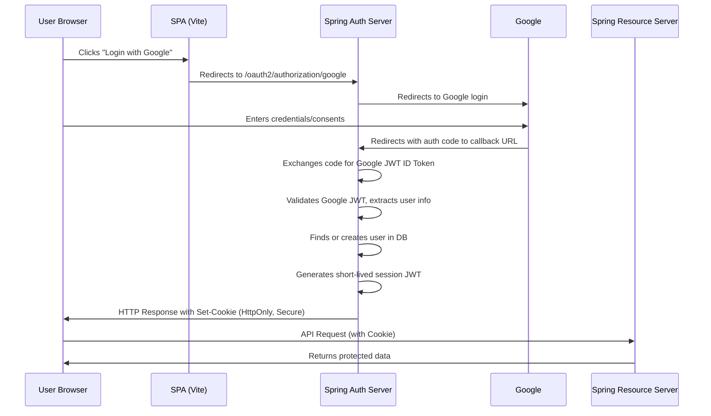
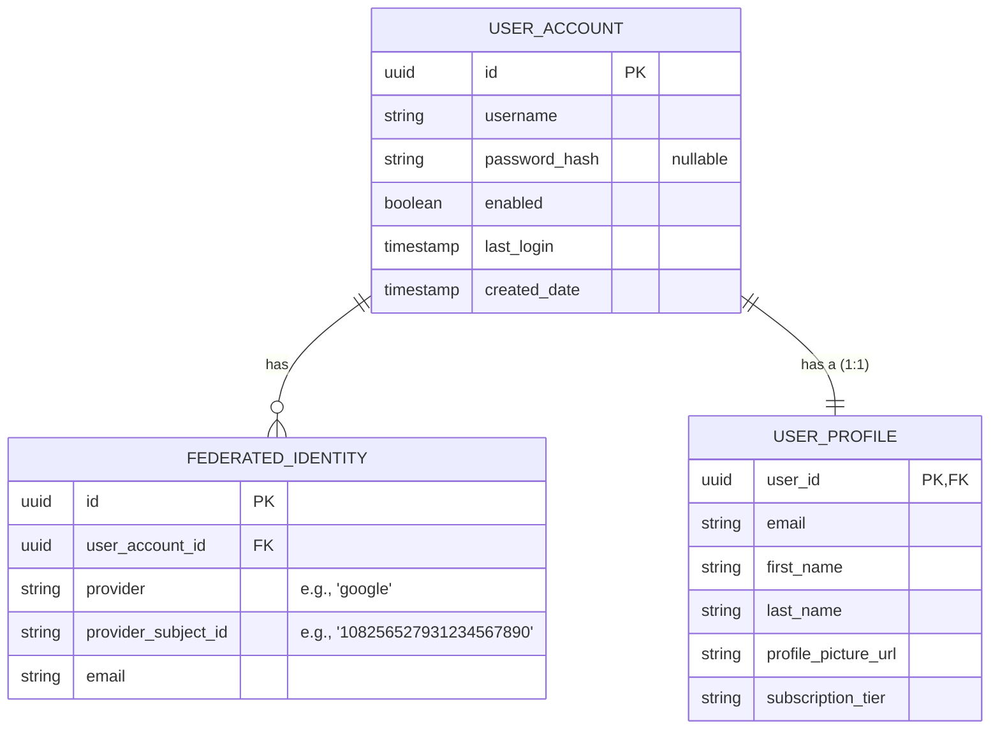
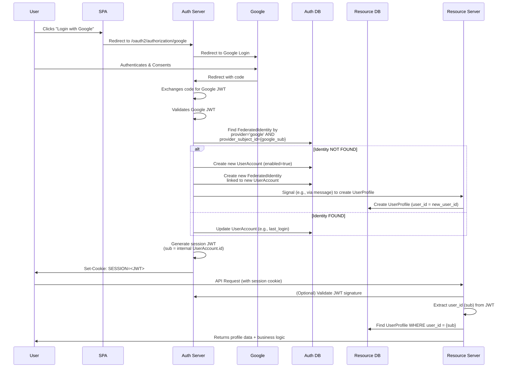

## QA1

question:

I have question about oauth2 implementation using SPA (built using Vite + Vanilla TS) integrated with dual backends - Auth server and Resource server (both built using Spring boot)

1) User logs in via Google OAuth2.
2) Spring Auth server federates and waits until user completes the authenticate. Once done auth server validates Google’s JWT, then issues its own short-lived JWT.
3) Stores this JWT in an HttpOnly + Secure + SameSite=Lax cookie.
4) SPA sends this cookie automatically; Spring validates it statelessly.

At Step 2 above, I think Spring auth server should create a user account and store in the data store. right?

Can you please explain this flow, stress on the steps auth server has to after fetching JWT from Google.

answer:

Of course. This is an excellent and modern approach to OAuth2 for SPAs. Let's break down the flow, focusing specifically on your questions about the Auth Server's responsibilities after receiving the Google JWT.

### The High-Level Flow (A Refresher)

Your understanding is correct. Here's a visual and step-by-step recap:

### Deep Dive: The Auth Server's Steps After Getting Google's JWT

This is the core of your question. Once your Spring Auth server receives the authorization code and exchanges it for Google's JWT ID Token, here are the critical steps it must perform:

**Step 1: Validate Google's JWT**
This is non-negotiable. The auth server must cryptographically verify the token.
*   Check the signature using Google's public keys (from `https://www.googleapis.com/oauth2/v3/certs`).
*   Verify the standard JWT claims: `iss` (issuer is Google), `aud` (audience is your client ID), `exp` (token hasn't expired), and `iat` (issued at time is valid).

**Step 2: Extract User Information**
*   From the validated JWT, extract the user's claims like `sub` (unique subject identifier), `email`, `email_verified`, `name`, `picture`, etc.

**Step 3: User Account Management (Your Question #2)**
**Yes, you are absolutely correct.** This is the crucial "federation" step. The auth server now needs to connect this external Google identity to an internal user account in your system. The process is often called **JIT (Just-In-Time) Provisioning**.

Here's how it works:

1.  The auth server uses a unique value from the Google JWT (typically the `sub` claim, as it is unique per user per Google client ID) to look for an existing user in your database.
2.  **If the user is FOUND:**
    *   The system retrie the existing internal user ID and profile.
    *   It's a good practice to update certain fields (like last login time, name, or profile picture) if they have changed on Google.
3.  **If the user is NOT FOUND:**
    *   The auth server **creates a new user account** in your database.
    *   It will store:
        *   `Internal User ID` (a UUID or auto-incrementing PK, your primary key).
        *   `Federated Identity ID` (e.g., `google|` or `google_`). **This is the key field.** It links your internal user to Google's `sub`.
        *   `Email`, `name`, and any other relevant profile information.
    *   You might set a random, unguessable password or leave the password field entirely `NULL` since this user will only ever log in via Google.

**Why is this necessary?** It decouples your application from Google. Your resource server doesn't care if the user came from Google, Facebook, or a username/password. It only cares about your internal user ID and permissions. This also allows a user to link multiple OAuth2 providers (Google, GitHub) to a single internal account later.

**Step 4: Generate Your Short-Lived Session JWT**
*   Now that you have an **internal user**, you create a JWT for *your* domain.
*   This JWT's subject (`sub`) should be your **internal user ID** from the database, *not* the Google `sub`.
*   Include any roles or authorities this user has in your system in the JWT claims.
*   Keep it short-lived (e.g., 15-30 minutes) for security.

**Step 5: Set the HttpOnly Cookie**
*   The auth server sends an HTTP response back to the browser.
*   The response includes the `Set-Cookie` header with your new JWT.
*   `HttpOnly`: Protects against XSS (JavaScript cannot read it).
*   `Secure`: Only sent over HTTPS.
*   `SameSite=Lax` or `Strict`: Protects against CSRF to a large degree. (With this flow, you might need a separate CSRF token for state-changing operations like POST, even with SameSite, depending on strictness. Spring Security has built-in support for this).

### How the Resource Server Works

1.  The SPA makes an API request to the resource server (e.g., `GET /api/protected-data`).
2.  The browser **automatically** attaches the session cookie with every request to your domain (thanks to the `SameSite` attribute).
3.  The resource server has a filter (`JwtAuthenticationFilter`) that:
    *   Extracts the JWT from the cookie.
    *   Validates its signature (using a shared secret or public key that the auth server also uses).
    *   If valid, it creates an `Authentication` object and stores the user's internal ID and authorities in the security context.
4.  Your controller methods can now securely check `@PreAuthorize` rules and use the internal user ID to fetch user-specific data from the database.

### Key Advantages of This Architecture

*   **Security:** The access token (your JWT) is never exposed to the SPA's JavaScript, making it immune to XSS theft.
*   **Simplicity:** The SPA doesn't handle tokens; it just lets the browser do what it does best (manage cookies).
*   **Proper Federation:** Your resource server deals only with your internal user identities, making it provider-agnostic.

### Critical Considerations

*   **CSRF Protection:** While `SameSite=Lax` cookies prevent *most* CSRF attacks, you should still protect state-changing requests (POST, PUT, DELETE). Spring Security provides CSRF tokens out of the box. Your SPA will need to read a CSRF token from a cookie (that is *not* HttpOnly) and send it back in a header (like `X-XSRF-TOKEN`) for these requests.
*   **CORS:** Your SPA's origin (e.g., `https://myapp.com`) must be configured as an allowed origin on both your Auth and Resource servers to handle the initial redirect and subsequent API calls.
*   **Cookie Domain:** Set the cookie's `Domain` attribute correctly (e.g., `.mydomain.com`) so it is accessible by both `auth.mydomain.com` and `api.mydomain.com` if you use different subdomains.

This flow is a robust and secure pattern for modern SPAs and is effectively how Cloud providers like AWS Cognito and Auth0 operate under the hood.

## QA2

question:

Do I need two entities UserAccount and UserProfile on the DB. UserAccount for maintaining auth related attributes and UserProfile for maintaining user profile and preference attributes? Spring Auth Server dealing with UserAccount and Resource server dealing with User Profile. Resource server deals with user subscriptions, user limits, user payment history etc. So I feel we should maintain 2 entities, but maintain some sort of relationship between them.

Please explain the workflow on how to work around the user account and profile.

answer:

Excellent question. This gets to the heart of designing a clean, scalable, and secure system architecture. Your intuition is correct.

**Yes, separating `UserAccount` (auth) and `UserProfile` (business) is a highly recommended best practice.** This is a classic example of the **Separation of Concerns** principle applied to your data model.

Let's break down the why, the how, and the workflow.

---

### Why Two Entities? The Rationale

1.  **Different Lifecycles and Change Rates:** Auth data (username, password hashes, enabled status) changes infrequently. Profile data (name, preferences, subscription tier) changes more often. Separating them prevents update contention and keeps tables lean.
2.  **Security Isolation:** Your Auth Server is a high-security component. It should have access **only** to the data it absolutely needs to perform authentication and authorization (the `UserAccount`). The Resource Server, which handles business logic, should not have direct access to critical auth fields like password hashes. This limits the "blast radius" in case of a vulnerability.
3.  **Scalability:** You can potentially scale the services differently. The Auth Server might be read-heavy during login bursts, while the Resource Server is constantly reading and writing profile data.
4.  **Clear Service Boundaries:** It enforces a clean API contract between your services. The Auth Server's job is to say "*This is user ID #123, and they have these roles.*" The Resource Server's job is to say "*Okay, now let me fetch the profile and data for user ID #123.*"

### The Proposed Data Model

**UserAccount (Managed by Auth Server)**
*   `id` (PK, UUID or Long): **This is the internal user ID that becomes the `sub` in your JWT.**
*   `username`: Could be the email, or a unique username.
*   `password_hash`: Only for users who use password login (nullable).
*   `enabled`: `true`/`false` if the account is active.
*   `account_non_locked`: For lockout logic.
*   `last_login`: Timestamp.
*   `created_date`: Timestamp.
*   ...other auth-specific fields.

**FederatedIdentity (Managed by Auth Server)**
*   `id` (PK)
*   `user_account_id` (FK to `UserAccount.id`)
*   `provider` (e.g., `google`, `github`)
*   `provider_subject_id` (The unique `sub` from Google's JWT)
*   `email` (as provided by the provider)

**UserProfile (Managed by Resource Server)**
*   `user_id` (PK, **also an FK to `UserAccount.id`**): This is the critical link. Note that the primary key of the profile is also the foreign key to the account. This is a "one-to-one" relationship.
*   `email`: A copy for display, notifications, etc. (denormalized for performance).
*   `first_name`
*   `last_name`
*   `profile_picture_url`
*   `preferences` (could be a JSON blob)
*   `subscription_tier`
*   `payment_status`
*   ...all other business-related attributes.

---

### The Detailed Workflow: From Google Login to Profile Access

Here is the step-by-step flow, incorporating the two entities:

**Explanation of Key Steps:**

1.  **Finding the User:** The Auth Server looks in its `FederatedIdentity` table for a record where `provider = 'google'` and `provider_subject_id = {the 'sub' from Google's JWT}`.

2.  **New User (JIT Provisioning):**
    *   The Auth Server creates a new `UserAccount` (with a new random `id`/UUID) and a new `FederatedIdentity` entry linked to it.
    *   **Here's the critical part:** The Auth Server now needs to signal the Resource Server to create a corresponding `UserProfile`. This can be done in a few ways:
        *   **Synchronous HTTP Call (Simple but creates a dependency):** The Auth Server makes a REST call to a internal admin endpoint on the RS (e.g., `POST /internal/user-profiles`) with the `user_id` and basic info (email, name) to create the profile.
        *   **Asynchronous Event (Robust and decoupled):** The Auth Server publishes a `UserCreatedEvent` to a message queue (e.g., Kafka, RabbitMQ). The Resource Server subscribes to this event and creates the `UserProfile` in its own database. This is the most scalable and fault-tolerant approach.

3.  **Existing User:** The Auth Server finds the linked `UserAccount` and updates it (e.g., `last_login`).

4.  **Resource Server Access:** When the RS gets a request, it trusts the `user_id` (`sub`) in the JWT. It uses this ID directly to look up the user's business data in its `UserProfile` table. **The Resource Server does not need to know anything about Google or authentication.** It only cares about the internal user ID.

### Summary

By splitting the entities, you achieve:

*   **Security:** The auth data is locked down in the Auth Server's database.
*   **Clarity:** The Auth Server manages identity. The Resource Server manages business logic. Their responsibilities don't overlap.
*   **Flexibility:** You can easily add new login providers (e.g., Facebook, Apple) by adding rows to the `FederatedIdentity` table without touching the core `UserAccount` or `UserProfile` structure.
*   **Maintainability:** Changes to the user's business profile do not affect the critical authentication pathways.

This design is a foundation for building a secure and scalable microservices architecture around identity and access management.

