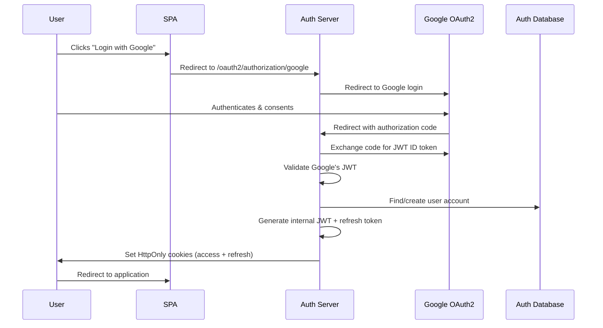
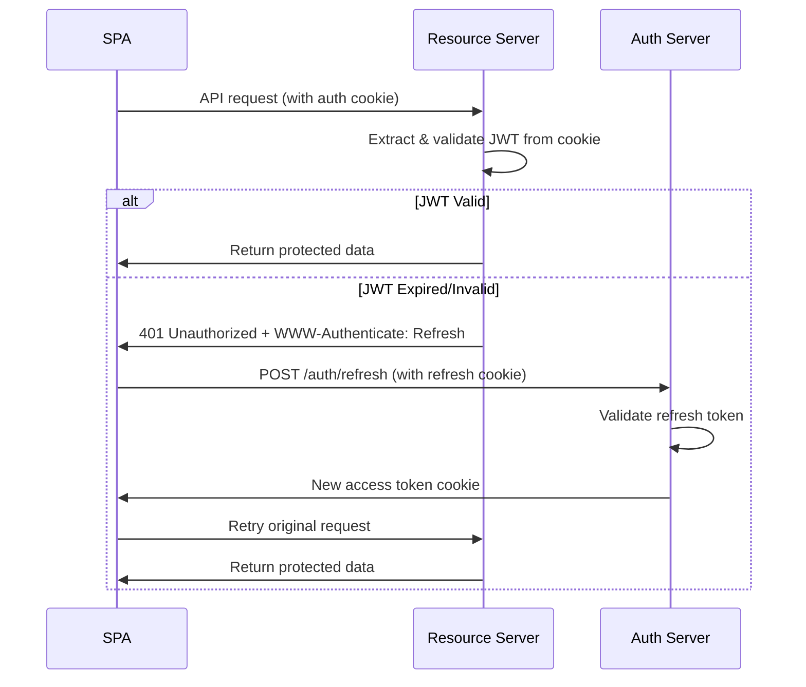
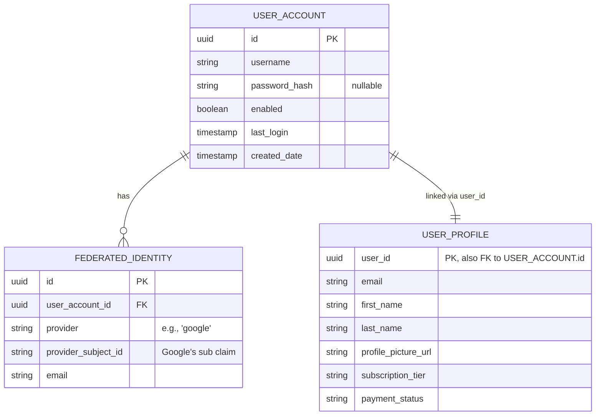

# OAuth2 Single Page Application Architecture with Spring Boot

## Table of Contents
1. [System Architecture Overview](#system-architecture-overview)
2. [Core Components](#core-components)
3. [Authentication Flow](#authentication-flow)
4. [Token Management Strategy](#token-management-strategy)
5. [Security Principles](#security-principles)
6. [Data Model Design](#data-model-design)

## System Architecture Overview

This document outlines a secure OAuth2 implementation for Single Page Applications (SPAs) using Spring Boot backend services with Google as the external identity provider. The architecture follows modern security best practices including HttpOnly cookies, JWT tokens, and proper separation of concerns.

### High-Level Architecture

```
┌─────────────┐    ┌─────────────────┐    ┌─────────────────┐    ┌─────────────┐
│    User     │◄──►│      SPA        │◄──►│  Spring Auth    │◄──►│   Google    │
│   Browser   │    │ (Vite + TS)     │    │    Server       │    │   OAuth2    │
└─────────────┘    └─────────────────┘    └─────────────────┘    └─────────────┘
                            │                       │
                            │                       │
                            ▼                       ▼
                   ┌─────────────────┐    ┌─────────────────┐
                   │  Spring         │    │   Database      │
                   │ Resource Server │    │   (Auth Data)   │
                   └─────────────────┘    └─────────────────┘
                            │
                            ▼
                   ┌─────────────────┐
                   │   Database      │
                   │ (Business Data) │
                   └─────────────────┘
```

## Core Components

### 1. Single Page Application (SPA)
- **Technology**: Vite + Vanilla TypeScript (no framework)
- **Responsibilities**:
  - User interface and interaction
  - Making API calls to Resource Server
  - Handling authentication flow redirects
  - Managing client-side state
- **Security Characteristics**:
  - Cannot directly access HttpOnly cookies
  - Relies on browser's automatic cookie handling
  - Implements silent token refresh mechanisms

### 2. Spring Auth Server
- **Technology**: Spring Boot 3.x + Spring Security 6.x
- **Primary Responsibilities**:
  - OAuth2 federation with Google
  - Traditional user management (registration, login, password reset)
  - JWT token issuance and validation
  - Session management via HttpOnly cookies
  - User account creation and management
- **Key Features**:
  - Supports both Google OAuth2 and traditional authentication
  - Issues separate access and refresh tokens
  - Manages federated identity linking
  - Provides token refresh endpoint for silent renewal

### 3. Spring Resource Server
- **Technology**: Spring Boot 3.x + Spring Security 6.x
- **Primary Responsibilities**:
  - Serves business API endpoints
  - Validates JWT access tokens
  - Manages user profiles and business data
  - Handles user subscriptions, limits, and payment history
- **Security Characteristics**:
  - Stateless JWT validation
  - No direct access to refresh tokens
  - Returns 401 with WWW-Authenticate: Refresh on token expiry

### 4. Google OAuth2 Provider
- **Role**: External Identity Provider (IdP)
- **Responsibilities**:
  - User authentication
  - Providing user profile information
  - Issuing OAuth2 tokens to Auth Server

## Authentication Flow

### 1. Initial Login Sequence



### 2. API Access Flow



## Token Management Strategy

### Token Types and Characteristics

| Token Type | Storage | Lifetime | Purpose | Security Level |
|------------|---------|----------|---------|----------------|
| **Access Token (JWT)** | HttpOnly Cookie (`access_token`) | 15-30 minutes | API authentication | High |
| **Refresh Token** | HttpOnly Cookie (`refresh_token`) | 7-30 days | Obtain new access tokens | Critical |

### Cookie Security Configuration

All authentication cookies must include:
- `HttpOnly`: Prevents JavaScript access (XSS protection)
- `Secure`: HTTPS transmission only
- `SameSite=Lax`: CSRF protection while allowing cross-site navigation
- Proper `Path` restrictions for scope limitation
- Appropriate `Domain` settings for subdomain access

### Separate Cookie Strategy

**Critical Security Principle**: Access and refresh tokens MUST be stored in separate HttpOnly cookies.

**Access Token Cookie**:
```http
Set-Cookie: access_token=eyJhbG...; HttpOnly; Secure; SameSite=Lax; Path=/; Max-Age=900
```

**Refresh Token Cookie**:
```http
Set-Cookie: refresh_token=abc123...; HttpOnly; Secure; SameSite=Strict; Path=/auth/refresh; Max-Age=604800
```

**Why Separate Cookies?**:
1. **Different Risk Profiles**: Refresh tokens are high-value, long-lived assets
2. **Scope Limitation**: Refresh tokens only sent to `/auth/refresh` endpoint
3. **Attack Surface Reduction**: Resource Server never sees refresh tokens
4. **Independent Revocation**: Can invalidate refresh tokens without affecting access tokens

## Security Principles

### 1. Defense in Depth
- Multiple security layers prevent single points of failure
- HttpOnly cookies + JWT validation + HTTPS + SameSite protection

### 2. Principle of Least Privilege
- Access tokens have minimal necessary scope and short lifetimes
- Refresh tokens restricted to specific endpoints via Path attribute
- Resource Server has no access to authentication secrets

### 3. Zero Trust Architecture
- Every request validated independently
- No implicit trust between components
- Stateless validation where possible

### 4. Secure by Default
- All cookies secured with proper attributes
- Short token lifetimes
- Automatic token rotation on refresh

## Data Model Design

### Separation of Concerns: UserAccount vs UserProfile

The system implements a clean separation between authentication and business data:

**UserAccount Entity** (Auth Server Database):
- Manages authentication-related attributes
- Stores federated identity mappings
- Handles account status and security settings

**UserProfile Entity** (Resource Server Database):
- Manages business-related user data
- Stores preferences, subscriptions, payment history
- Linked to UserAccount via shared user ID

### Entity Relationship



### Benefits of This Design

1. **Security Isolation**: Auth data separated from business data
2. **Service Boundaries**: Clear responsibilities between Auth and Resource servers
3. **Scalability**: Services can scale independently
4. **Flexibility**: Easy to add new identity providers
5. **Maintainability**: Changes to business logic don't affect authentication

This architecture provides a robust, secure, and scalable foundation for modern web applications requiring OAuth2 authentication with external identity providers.