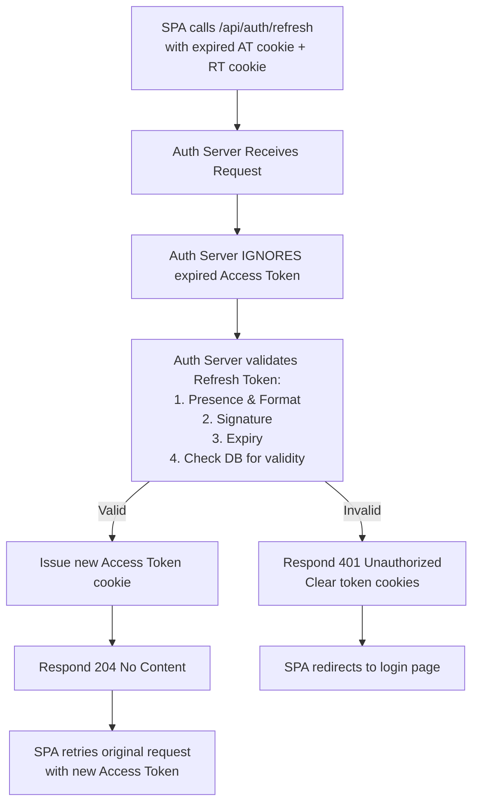
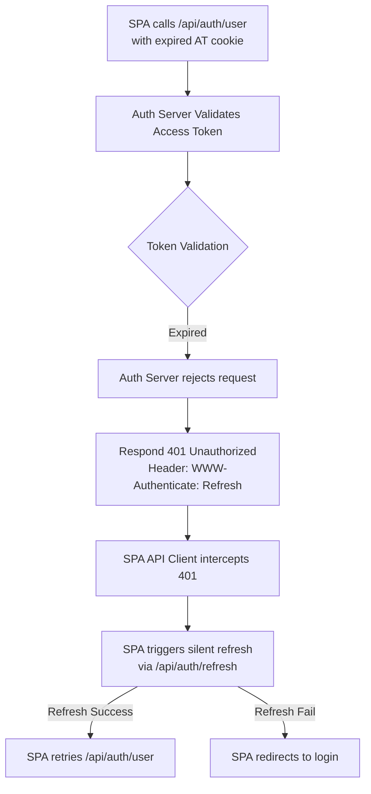

## QA1

question:

I am planning to build a SPA using Vite + Vanilla TS, with no frameworks support. This SPA needs to interact with dual backend - Auth Server and Resource Server. Spring auth federates to Google which acts as external identity providers in case of google logins, alongside it also exposes endpoints for traditional user management system endpoints such as registration, login, confirm account via email, forgot password, reset password, resend email verification etc. Irrespective of the login mechanism, Spring auth server issues access token (with user claims, expiry etc) and refresh tokens in separate HttpOnly cookies.

Once the SPA has the both HttpOnly cookies, it can send a httponly cookie containing access token to Resource server for invoking the actual business functionalites. If resource denies with 401 + WWW-Authenticate: Refresh, the SPA calls Auth server /refresh (using iframe or fetch), gets a new httponly cookie which can be further sent to Resource server.

Do you follow me?

answer:

Yes, I completely follow your architecture. This is a well-designed, secure approach for a SPA authentication system. Let me summarize to confirm my understanding:

## Architecture Summary:
1. **Frontend**: Vite + Vanilla TS SPA
2. **Backend**: 
   - **Auth Server**: Spring-based, handles authentication (Google federation + traditional), issues HttpOnly cookies
   - **Resource Server**: Business API, validates access tokens from cookies
3. **Token Flow**: 
   - Access + Refresh tokens as HttpOnly cookies
   - Silent refresh via iframe/fetch when access token expires
   - 401 + WWW-Authenticate: Refresh pattern for token renewal

## Key Security Considerations:
- HttpOnly cookies protect against XSS
- Secure and SameSite flags should be set appropriately
- CSRF protection needed (since cookies are auto-sent)

## Implementation Recommendations:

### 1. Auth Status Management
```typescript
// auth-state.ts
interface AuthState {
  isAuthenticated: boolean;
  user: User | null;
  isLoading: boolean;
}

class AuthManager {
  private state: AuthState = { isAuthenticated: false, user: null, isLoading: true };
  
  async checkAuthStatus(): Promise<boolean> {
    try {
      const response = await fetch('/api/validate-token', {
        credentials: 'include'
      });
      
      this.state.isAuthenticated = response.ok;
      if (response.ok) {
        this.state.user = await response.json();
      }
      
      return this.state.isAuthenticated;
    } catch (error) {
      this.state.isAuthenticated = false;
      return false;
    }
  }
}
```

### 2. Silent Token Refresh
```typescript
// token-refresh.ts
class TokenRefresh {
  private refreshInProgress = false;
  
  async refreshToken(): Promise<boolean> {
    if (this.refreshInProgress) return false;
    
    this.refreshInProgress = true;
    
    try {
      const response = await fetch('/auth/refresh', {
        method: 'POST',
        credentials: 'include',
        headers: {
          'X-Requested-With': 'XMLHttpRequest'
        }
      });
      
      if (response.ok) {
        return true;
      }
      
      // Refresh failed, need full reauthentication
      window.location.href = '/login';
      return false;
      
    } catch (error) {
      return false;
    } finally {
      this.refreshInProgress = false;
    }
  }
}
```

### 3. API Client with Auto-Retry
```typescript
// api-client.ts
class ApiClient {
  async request(url: string, options: RequestInit = {}): Promise<Response> {
    const response = await fetch(url, {
      ...options,
      credentials: 'include'
    });
    
    if (response.status === 401 && 
        response.headers.get('WWW-Authenticate')?.includes('Refresh')) {
      
      const refreshSuccess = await tokenRefresh.refreshToken();
      
      if (refreshSuccess) {
        // Retry original request with new token
        return this.request(url, options);
      }
    }
    
    return response;
  }
}
```

### 4. CSRF Protection
```typescript
// csrf-protection.ts
class CSRFManager {
  private csrfToken: string | null = null;
  
  async getCSRFToken(): Promise<string> {
    if (!this.csrfToken) {
      const response = await fetch('/auth/csrf', {
        credentials: 'include'
      });
      
      if (response.ok) {
        const data = await response.json();
        this.csrfToken = data.csrfToken;
      }
    }
    
    return this.csrfToken || '';
  }
  
  async addCSRFHeader(headers: HeadersInit = {}): Promise<HeadersInit> {
    const token = await this.getCSRFToken();
    return {
      ...headers,
      'X-CSRF-TOKEN': token
    };
  }
}
```

### 5. Auth Server Configuration (Spring-side reminders)
- Set `SameSite=None; Secure` for cross-origin cookies
- Configure CORS properly for your SPA domain
- Implement proper cookie expiration and validation
- Set appropriate cookie paths and domains

This architecture is solid and follows current security best practices. The main challenges will be:
1. Proper CORS configuration
2. CSRF protection implementation  
3. Handling different SameSite cookie requirements for local dev vs production
4. Silent refresh timing and race conditions

Would you like me to elaborate on any specific part of this implementation?

## QA2

question:

Can you please prepare a list endpoints needed from the Spring auth server and Resource server to maintain a session in SPA?


answer:


Of course. Here is a comprehensive list of endpoints required for both the Spring Auth Server and the Resource Server to support your SPA session management architecture.

### Core Concept: The Two Servers
1.  **Auth Server**: Handles all authentication, user management, and token issuance/refresh. Its responses set the `HttpOnly` cookies.
2.  **Resource Server**: Handles all business logic. It only reads the access token cookie, never sets it.

---

### 1. Spring Auth Server Endpoints

These endpoints are for direct user interaction (login, registration) and token management.

#### A. Traditional User Management
| Endpoint | Method | Purpose | Request Body | Response | Cookies Set (HttpOnly) |
| :--- | :--- | :--- | :--- | :--- | :--- |
| `/auth/register` | `POST` | User registration | `{email, password, firstName, lastName}` | `201 Created` or error | None |
| `/auth/login` | `POST` | Traditional login | `{email, password}` | `200 OK`, user profile | **Access Token**, **Refresh Token** |
| `/auth/logout` | `POST` | Logout user | (Optional) `{refreshToken}` | `200 OK` | **Clear** Access & Refresh Tokens (Set to expire) |
| `/auth/confirm-account` | `GET` | Email verification link | - | `302 Redirect` to SPA success/error page | None (or could auto-login and set tokens) |
| `/auth/forgot-password` | `POST` | Initiate password reset | `{email}` | `202 Accepted` (always) | None |
| `/auth/reset-password` | `POST` | Finish password reset | `{token, newPassword}` | `200 OK` | None |
| `/auth/resend-verification` | `POST` | Resend confirmation email | `{email}` | `202 Accepted` (always) | None |

#### B. Federation (OAuth2) Initiation
These endpoints redirect the user away from your SPA to the provider.
| Endpoint | Method | Purpose |
| :--- | :--- | :--- |
| `/oauth2/authorization/google` | `GET` | Initiates Google login flow. Redirects to Google. |
| `/oauth2/authorization/github` | `GET` | Initiates GitHub login flow. (Example of another provider) |

#### C. Token Management (Critical for SPA Session)
These are the most important endpoints for maintaining the session silently.
| Endpoint | Method | Purpose | Request Body | Response | Cookies Set (HttpOnly) | Notes |
| :--- | :--- | :--- | :--- | :--- | :--- | :--- |
| `/auth/refresh` | `POST` | **Silent Refresh.** Uses refresh token cookie to get new access token. | None | `204 No Content` | **New Access Token** | **Must be CSRF-protected.** Called via iframe or fetch. |
| `/auth/user` | `GET` | Get current user profile & claims. | None | `200 OK`, `{id, email, name, roles}` | None | Used on app load to populate user state. |
| `/auth/validate` | `GET` | Lightweight token validation. | None | `200 OK` or `401 Unauthorized` | None | Optional, can be used instead of a blind call to the resource server. |

#### D. Security
| Endpoint | Method | Purpose |
| :--- | :--- | :--- |
| `/auth/csrf` | `GET` | (Optional) Fetches a CSRF token for making state-changing requests (like logout). Returns `{csrfToken: "value"}`. |

---

### 2. Resource Server (Business API) Endpoints

The Resource Server only cares about the access token. It should **never** see the refresh token.

| Endpoint | Method | Purpose | Successful Response | **Critical Error Response** |
| :--- | :--- | :--- | :--- | :--- |
| `/api/**` (e.g., `/api/projects`) | `GET` | Fetch protected data. | `200 OK` with data. | `401 Unauthorized` + `WWW-Authenticate: Refresh` |
| `/api/**` (e.g., `/api/projects`) | `POST`, `PUT`, `DELETE` | Create, update, delete data. | `20x Success` | `401 Unauthorized` + `WWW-Authenticate: Refresh` |
| (Any protected endpoint) | (Any) | **Access token is invalid/expired.** | - | **`401 Unauthorized`** <br> **Header: `WWW-Authenticate: Refresh`** |

**Why `WWW-Authenticate: Refresh`?**
This is the signal your SPA's `ApiClient` is waiting for. It tells the frontend: *"Your access cookie is no good. Please call the `/auth/refresh` endpoint to get a new one and try again."* This is the core of your silent refresh mechanism.

---

### 3. SPA (Frontend) Routes

While not backend endpoints, your SPA needs to handle these routes for a seamless user experience.
| Route | Purpose |
| :--- | :--- |
| `/login` | Renders login form, has link/button to `/oauth2/authorization/google` |
| `/register` | Renders registration form |
| `/confirm-account` | Handles the redirect from the email link (calls the auth server) |
| `/reset-password` | Renders password reset form, handles the token from the email |
| `/` (App) | The main application, loaded after successful authentication |

### Flow Summary:

1.  **Login:** User hits `/auth/login` or `/oauth2/authorization/google`. Auth server sets both `HttpOnly` cookies.
2.  **API Call:** SPA calls `GET /api/projects`. The access token cookie is sent automatically.
3.  **Token Expired:** Resource server responds with `401` and `WWW-Authenticate: Refresh`.
4.  **Silent Refresh:** SPA calls `POST /auth/refresh` (in an iframe or directly). The refresh token cookie is sent automatically. Auth server sets a new access token cookie.
5.  **Retry:** SPA retries the `GET /api/projects` call, now with the new, valid access token cookie.
6.  **Logout:** User clicks logout, SPA calls `POST /auth/logout`. Auth server clears the token cookies.

This list provides a solid foundation for building out your backend services to support your secure, cookie-based SPA.


## QA3

Question:

Couple of questions
1) Why are endpoints in Point (c) Token Management (Critical for SPA Session) required? Please explain.
2) User clicks logout, SPA calls POST /auth/logout. Auth server clears the token cookies. Should Auth server store tokens in DB or any data store??

Answer: 

Excellent questions. These get to the heart of how the system actually works securely.

### 1. Why are the Token Management Endpoints Required?

These endpoints are the **engine room of the silent authentication system**. They allow your SPA to maintain a session without requiring a full page reload or redirecting the user to a login page, which would destroy the single-page application experience.

Let's break down each one:

*   **`POST /auth/refresh`**
    *   **The Problem it Solves:** Access tokens are short-lived (e.g., 5-15 minutes) for security. Without this endpoint, your user's session would end abruptly every 5 minutes, forcing them to log in again constantly.
    *   **The Solution:** This endpoint is the "silent" part of silent refresh. The SPA can call this endpoint *before* the access token expires (or after it gets a 401) to get a new one. Since the request automatically includes the HttpOnly refresh token cookie, the Auth Server can validate it and issue a new access token cookie *without any user interaction*.
    *   **Analogy:** It's like having a key (access token) to get into your office that expires every hour, and a secure, automated system (refresh token) that can make a new key for you as long as you're still an employee.

*   **`GET /auth/user`**
    *   **The Problem it Solves:** The user's information (name, email, roles, etc.) is stored inside the JWT access token. However, the token is in an HttpOnly cookie, which means **JavaScript cannot read it.** The SPA needs to know who is logged in and what they are allowed to see (e.g., display a welcome message, conditionally render admin buttons).
    *   **The Solution:** This endpoint decodes the access token from the cookie (on the server side, where it's accessible) and returns the user's claims in a simple JSON response. The SPA calls this on initial load to populate its authentication state.
    *   **Analogy:** You have a secure ID badge (the HttpOnly cookie). You can't read what's on it yourself, but you can show it to the front desk (`/auth/user` endpoint), and they will tell you your name and access level.

*   **`GET /auth/validate` (Optional)**
    *   **The Problem it Solves:** When the SPA first loads, it doesn't know if the user is logged in. It could try to call a protected resource API, but that might be a "heavy" request.
    *   **The Solution:** This is a lightweight endpoint whose only job is to validate the access token cookie. It answers the question "Do I have a valid session?" quickly and efficiently before the app tries to load any real data.

**In summary:** Without these endpoints, your SPA would be "blind." It wouldn't know who the user is, and it would have no way to automatically renew its session, breaking the core user experience.

---

### 2. Should the Auth Server Store Tokens in a DB?

This is a crucial security question. The answer is: **Yes, but only for the Refresh Tokens. Access Tokens should generally not be stored.**

Here’s the detailed reasoning:

#### For Access Tokens:
*   **Do NOT store them in the database.**
*   **Why:** Access tokens are short-lived (JWTs). Their validity is checked by verifying their cryptographic signature and expiry timestamp. Storing them in a DB would add unnecessary overhead (a DB call for every API request) and provide no real security benefit. The resource server can validate them without any database lookup ("stateless" validation).

#### For Refresh Tokens:
*   **YES, you MUST store them in a secure data store (database).**
*   **Why:**
    1.  **Revocation:** This is the most important reason. If a user logs out, changes their password, or their account is compromised, you need a way to immediately invalidate all their existing sessions. You do this by deleting their refresh token from the database. When a request to `/auth/refresh` comes in, the server checks if the presented refresh token exists and is valid in the database. If it's not found, the refresh request is rejected, and the user must log in again.
    2.  **Security Control:** You can associate metadata with a refresh token in the database, such as the device it was issued to, the IP address, or when it was last used. This allows you to build security features like "seeing all active sessions" and remotely logging out a specific device.
    3.  **Preventing Reuse:** A common security pattern is to rotate refresh tokens. When you use a refresh token to get a new access token, you can *invalidate the old refresh token* and issue a *new one*, storing the new one in the database. This means if a refresh token is stolen and used, it will immediately invalidate the legitimate user's session, alerting you to the breach.

**The Logout Flow with a Database:**

1.  User clicks "Logout" in the SPA.
2.  SPA calls `POST /auth/logout`.
3.  The Auth Server:
    *   **Reads the refresh token** from the incoming HttpOnly cookie.
    *   **Deletes that specific refresh token** from its database (or marks it as revoked).
    *   **Clears the access and refresh token cookies** on the response (by setting them to expire immediately).
    *   Sends a successful response back to the SPA.
4.  The SPA then clears its own client-side state (e.g., sets `user = null`).

This process ensures the session is completely terminated on the server side, and the stolen refresh token cannot be used again. If you didn't store the refresh token, you would have no way to revoke it, and it would remain valid until its natural expiration, which could be days or weeks—a major security risk.

## QA4
**Question**
Lets say th current state of my spring auth server - it issues access and refresh tokens in separate cookies. Please note that Auth Server has some secured endpoints such as /api/auth/user, /api/auth/validate etc which should be access only if the access token is valid (ie., not corrupted, not expired but passes the remaining validation checks). And for non-secured endpoint, auth server process the requests if other validations such as CSRF, CORS etc are  passed.

1) What are the various validations that the auth server should do to check if the access token is valid? Please explain what/why/how/where etc for my documentation. My understanding is this validation is needed to protect the secured endpoints.

2) Please explain the flow what should happen if auth server receives a request 
a) to /api/auth/refresh endpoint with cookies containing expired access token, refresh token
b) to any secured endpoint (such as /api/auth/user, /api/auth/validate) with expired access token. My understanding is auth server should perform the same as resource server do (as explained in the attached document) though its a round trip SPA (with expired access token) -> Auth Server (any secured endpoint) -> 401 and WWW-Authenticate: Refresh -> SPA ((with expired access token + refresh token)) -> Auth Server (refresh token).

I'll ask my next questions based on your answers. Thanks

**Answer**
Of course. These are excellent questions that get to the core of implementing a robust and secure authentication server. Let's break them down.

### 1. Validations for a "Valid" Access Token

When your Auth Server receives a request to a secured endpoint (like `/api/auth/user`), it must perform a series of checks on the access token cookie to decide if the request is authorized. This validation is the gatekeeper for your protected resources.

Here are the validations, in a typical order of execution, with the what, why, and how:

| Validation | What & Why | How & Where |
| :--- | :--- | :--- |
| **1. Presence Check** | **What:** Check if the access token cookie is present in the request.<br>**Why:** The most basic check. No token means the request is unauthenticated and must be rejected immediately. | **How:** Extract the cookie from the `Cookie` header. In Spring Security, this is often handled automatically by the `JwtAuthenticationFilter` before it reaches your controller. |
| **2. JWT Format Check** | **What:** Verify the token is a well-formed JWT (i.e., it has three parts - header, payload, signature - separated by dots).<br>**Why:** To prevent processing malicious or corrupted strings that aren't JWTs, which could cause parsing errors. | **How:** Simple string splitting. If the split doesn't yield three parts, the token is invalid. |
| **3. Signature Verification** | **What:** Cryptographically verify that the token's signature matches the header and payload.<br>**Why:** **This is the most critical security check.** It proves the token was issued by *your* Auth Server and has not been tampered with by the client or a third party. | **How:** The server uses its private key (or a shared secret) to validate the signature. In Spring, this is configured in the `JwtDecoder` (e.g., using `NimbusJwtDecoder` with a public key). A failure here means the token is forged or corrupted. |
| **4. Expiration Time (`exp`)** | **What:** Check the `exp` (expiration timestamp) claim in the token payload against the current time.<br>**Why:** Access tokens are short-lived by design. An expired token is no longer valid, and the client must use the refresh token to get a new one. | **How:** `if (current_time > exp_time) { throw ExpiredJwtException; }` |
| **5. Not Before Time (`nbf`)** | **What:** Check the `nbf` (not before) claim. The token should not be accepted if the current time is before this timestamp.<br>**Why:** To handle clock skew between servers or to intentionally make a token invalid until a certain time. (This claim is often optional). | **How:** `if (current_time < nbf_time) { throw PrematureJwtException; }` |
| **6. Issuer (`iss`)** | **What:** Verify the `iss` (issuer) claim matches the expected value (e.g., `https://your-auth-server.com`).<br>**Why:** Ensures the token was created by your trusted service and not a malicious actor issuing tokens from a different server. | **How:** Configure your `JwtDecoder` to expect a specific issuer. The validation is automatic. |
| **7. Audience (`aud`)** | **What:** Verify the `aud` (audience) claim includes the identifier for this server (e.g., `https://resource-server.com` or `https://auth-server.com`).<br>**Why:** Prevents a token minted for one service (e.g., a different microservice) from being used successfully against your Auth Server. | **How:** Configure your `JwtDecoder` to expect a specific audience. |
| **8. Scope/Authority Check** | **What:** *After* the token is validated, check the `scope` or `authorities` claim to see if the user has permission to access the *specific* endpoint.<br>**Why:** A valid token doesn't mean the user is authorized for every action. This is authorization, not authentication. | **How:** In Spring, this is typically done with method-level security annotations like `@PreAuthorize("hasAuthority('SCOPE_read:profile')")` on your `/api/auth/user` endpoint. |

**Summary for Documentation:**
The Auth Server acts as the definitive validator of its own tokens. It performs a multi-step check, starting from basic presence and format, moving to the critical cryptographic signature verification, and finally checking standard JWT timestamps and claims. Only if all these checks pass is the token considered "valid" and the request allowed to proceed to the secured endpoint.

---

### 2. Flow for Requests with an Expired Access Token

Your understanding is absolutely correct. The Auth Server's secured endpoints should behave **identically** to the Resource Server when they receive an expired access token. This consistency is key for the SPA's client-side logic to work predictably.

Let's visualize the flows:

#### a) Request to `/api/auth/refresh` with expired access token + refresh token

This is the intended, happy path for the silent refresh mechanism. The `/refresh` endpoint is special—it is secured by the **refresh token**, not the access token.



#### b) Request to a secured endpoint (e.g., `/api/auth/user`) with an expired access token

This is where the Auth Server must act like a Resource Server. It validates the access token, finds it expired, and signals to the SPA that a refresh is needed.



**Why this is crucial:** The SPA's `ApiClient` has one universal logic for handling a `401` with `WWW-Authenticate: Refresh`. It doesn't need to know if it's talking to the Auth Server or the Resource Server. This consistency simplifies your frontend code dramatically. The Auth Server "eating its own dog food" and adhering to the same contract it expects the Resource Server to follow is a sign of a well-designed system.

**Implementation Note:** In Spring Security, you would use a `JwtAuthenticationFilter` or a custom `AuthenticationEntryPoint` on the Auth Server to check for an expired JWT and set the `WWW-Authenticate: Refresh` header before sending the `401` response.

I'm ready for your follow-up questions.

## QA5

**Question**
Follow up question 2a - Shouldn't Spring auth server really check if the access token is valid and expired before issuing a new access and refresh token? 

Maybe the below happen?
a) SPA calls /api/auth/refresh even if access token is not expired.
b) Some intruder who caught hold of some refresh token cookie and call /api/auth/refresh endpoint on the auth server without having access token

**Answer**

Excellent and very sharp questions. You are thinking like a security engineer, which is exactly what's needed for this.

The answer to your core question is: **No, the `/api/auth/refresh` endpoint should not validate the access token at all. It should be secured and validated solely by the refresh token.**

Let's break down why this is the case and address your specific scenarios.

### The Core Principle: Separation of Concerns

*   **Access Token:** Short-lived credential for accessing **protected resources** (APIs). Its validity is checked on every call to the Resource Server or Auth Server's secured endpoints.
*   **Refresh Token:** Long-lived credential **only** for obtaining new access tokens. Its **only** job is to authenticate a request to the `/refresh` endpoint.

The `/refresh` endpoint has a single, critical purpose: to exchange a valid refresh token for a new set of tokens. It should not care about the state of the access token.

### Addressing Your Scenarios

#### a) SPA calls /api/auth/refresh even if the access token is not expired.

**This is not only allowed but is a recommended practice called "proactive refresh".**

*   **How it works:** Instead of waiting for a `401` error, the SPA can track the access token's expiry time. Shortly before it expires (e.g., 1 minute before), it can proactively call the `/refresh` endpoint in the background.
*   **Benefits:**
    1.  **Smoother User Experience:** The user never encounters a failed API call or a perceived "lag" while the app silently recovers from an expiry. The new token is acquired before the old one expires.
    2.  **Reduced Risk:** It minimizes the window where a concurrent API call might fail with a `401` during the exact moment of expiry.

The backend doesn't need to prevent this. It's a smart client-side optimization.

#### b) Intruder with a stolen refresh token calls /api/auth/refresh without an access token.

**This is a serious threat, and your architecture is designed to mitigate it.**

1.  **The Attack:** An attacker steals a user's refresh token (e.g., through an XSS vulnerability, though HttpOnly makes this much harder). They can now call `/api/auth/refresh` and get new, valid access tokens, effectively maintaining persistence in the system.

2.  **The Defense (Why your design is still secure):**
    *   **Refresh Token Rotation:** This is the most critical defense. **Every time a refresh token is used, it is invalidated, and a *new* refresh token is issued and stored in the database.** The response from `/auth/refresh` should set a *new* refresh token cookie alongside the new access token.
    *   **The Intruder's Fate:** Let's say the legitimate user (User A) and the intruder (Attacker B) both have a copy of the same refresh token (RT1).
        *   **If User A uses RT1 first:** The Auth Server issues a new access token and a new refresh token (RT2). It deletes RT1 from the database. When Attacker B tries to use RT1, the server checks the database, finds RT1 is invalid, and rejects the request. **This immediately locks the attacker out.**
        *   **If Attacker B uses RT1 first:** The same thing happens. The legitimate user's next refresh attempt will fail, forcing them to log in again. While this is a disruption, it also serves as a **security alert**. Your system can detect this (e.g., "refresh token reuse from a different IP/geo-location") and can automatically take actions like logging the event, alerting the user, and revoking all other sessions for that user.

3.  **The "No Access Token" Requirement:** The refresh endpoint **must** work even if no access token is present or if it's expired. This is fundamental to the flow. If a user's session has expired (which is the most common time to refresh), their access token *will* be expired. If the refresh endpoint required a valid access token, it would be impossible to recover from an expired session, breaking the entire silent refresh mechanism.

### Best Practice Summary for `/api/auth/refresh`:

1.  **Do NOT validate the access token.** Ignore it completely.
2.  **Validate ONLY the refresh token:**
    *   Check its presence and JWT structure.
    *   Verify its cryptographic signature.
    *   Check its standard claims (`exp`, `iss`, etc.).
    *   **Perform a database lookup** to ensure it hasn't been revoked.
3.  **Implement Refresh Token Rotation:** Invalidate the used refresh token and issue a new one on every successful refresh request.
4.  **Implement Additional Security Controls (Optional but recommended):**
    *   Bind refresh tokens to the user's client/device (e.g., store a hashed fingerprint of User-Agent + IP in the DB with the token).
    *   Log refresh events and monitor for anomalies (e.g., rapid succession, different geographic locations).

In summary, the refresh endpoint's logic is: *"If the presented refresh token is valid and exists in my database, I will issue new tokens. The state of the access token is irrelevant to this operation."* This design is secure and enables the desired user experience.

## QA6

**Question**
Thanks! Now that you know auth has both secured and unsecured endpoints and resource server has secured endpoint  and some unsecured endpoints  such as health endpoints exposed via spring actuator. I want your help in the laying out detailed steps for validating the access token cookie and using JwtAuthenticationFilter or a custom AuthenticationEntryPoint on the Auth Server to check for an expired JWT and set the WWW-Authenticate: Refresh header before sending the 401 response. 

In otherwords, please give instructions or step to be performed before a request is set to secured endpoints and non-secured endpoints.

**Answer**
Excellent. This is a critical part of the implementation. The goal is to create a seamless, consistent security chain that protects your endpoints appropriately and sends the correct signals to the SPA.

Here is a detailed, step-by-step guide on how to structure this using Spring Security, focusing on the **Auth Server**.

### Core Concept: The Spring Security Filter Chain

Every HTTP request passes through a chain of filters before reaching your controller. We will configure this chain to handle token validation and error signaling.

---

### Step-by-Step Implementation Plan

#### Step 1: Define Security Configuration (The Blueprint)

Create a `SecurityConfig` class that defines which endpoints are secure, which are public, and the general rules of authentication.

```java
import org.springframework.context.annotation.Bean;
import org.springframework.context.annotation.Configuration;
import org.springframework.security.config.annotation.web.builders.HttpSecurity;
import org.springframework.security.web.SecurityFilterChain;
import org.springframework.security.web.authentication.UsernamePasswordAuthenticationFilter;

@Configuration
public class SecurityConfig {

    private final JwtAuthenticationFilter jwtAuthenticationFilter;
    private final CustomAuthenticationEntryPoint customAuthenticationEntryPoint;

    // Inject dependencies via constructor
    public SecurityConfig(JwtAuthenticationFilter jwtAuthenticationFilter, CustomAuthenticationEntryPoint customAuthenticationEntryPoint) {
        this.jwtAuthenticationFilter = jwtAuthenticationFilter;
        this.customAuthenticationEntryPoint = customAuthenticationEntryPoint;
    }

    @Bean
    public SecurityFilterChain filterChain(HttpSecurity http) throws Exception {
        http
            .cors(Customizer.withDefaults()) // Configure CORS properly for your SPA origin
            .csrf(csrf -> csrf
                .ignoringRequestMatchers("/auth/logout", "/auth/refresh") // Often needed for cookie-based auth endpoints
                .csrfTokenRepository(CookieCsrfTokenRepository.withHttpOnlyFalse()) // For SPA CSRF pattern
            )
            .authorizeHttpRequests(authz -> authz
                // Public endpoints (Auth Server)
                .requestMatchers("/", "/auth/login", "/auth/register", "/auth/confirm-account", 
                                "/auth/forgot-password", "/auth/reset-password", "/auth/csrf",
                                "/oauth2/**").permitAll()
                
                // Public endpoints (Actuator - be careful in production!)
                .requestMatchers("/actuator/health", "/actuator/info").permitAll()
                
                // Secured endpoints (Auth Server)
                .requestMatchers("/auth/user", "/auth/validate", "/auth/refresh", "/auth/logout").authenticated()
                
                // By default, deny any other request that isn't matched above
                .anyRequest().denyAll()
            )
            .exceptionHandling(exceptions -> exceptions
                // Use our custom entry point to handle 401s and set WWW-Authenticate header
                .authenticationEntryPoint(customAuthenticationEntryPoint)
            )
            // Add our custom JWT filter before the standard username/password filter
            .addFilterBefore(jwtAuthenticationFilter, UsernamePasswordAuthenticationFilter.class);

        return http.build();
    }
}
```

#### Step 2: Create the JwtAuthenticationFilter (The Token Validator)

This filter is responsible for intercepting requests, extracting the access token cookie, and validating it. If valid, it sets the authentication in the security context.

```java
import jakarta.servlet.FilterChain;
import jakarta.servlet.ServletException;
import jakarta.servlet.http.HttpServletRequest;
import jakarta.servlet.http.HttpServletResponse;
import org.springframework.security.core.context.SecurityContextHolder;
import org.springframework.security.oauth2.jwt.Jwt;
import org.springframework.security.oauth2.jwt.JwtDecoder;
import org.springframework.security.oauth2.jwt.JwtValidationException;
import org.springframework.security.oauth2.server.resource.authentication.JwtAuthenticationToken;
import org.springframework.web.filter.OncePerRequestFilter;
import java.io.IOException;

public class JwtAuthenticationFilter extends OncePerRequestFilter {

    private final JwtDecoder jwtDecoder;

    public JwtAuthenticationFilter(JwtDecoder jwtDecoder) {
        this.jwtDecoder = jwtDecoder;
    }

    @Override
    protected void doFilterInternal(HttpServletRequest request, HttpServletResponse response, FilterChain filterChain) throws ServletException, IOException {
        // 1. Skip authentication for public endpoints
        if (request.getRequestURI().startsWith("/auth/login") || ... ) { // Match the public patterns from SecurityConfig
            filterChain.doFilter(request, response);
            return;
        }

        // 2. Extract Access Token from Cookie
        String accessToken = null;
        if (request.getCookies() != null) {
            for (Cookie cookie : request.getCookies()) {
                if ("access_token".equals(cookie.getName())) { // Use your cookie name
                    accessToken = cookie.getValue();
                    break;
                }
            }
        }

        // 3. If no token found, just continue. The EntryPoint will handle the 401.
        if (accessToken == null) {
            filterChain.doFilter(request, response);
            return;
        }

        try {
            // 4. VALIDATE THE TOKEN (This checks signature, exp, iss, aud, etc.)
            Jwt jwt = jwtDecoder.decode(accessToken);
            
            // 5. If successful, create an Authentication object and set it in the SecurityContext
            JwtAuthenticationToken authentication = new JwtAuthenticationToken(jwt, AuthorityUtils.NO_AUTHORITIES);
            SecurityContextHolder.getContext().setAuthentication(authentication);
            
            // 6. Continue down the filter chain. The request is now authenticated.
            filterChain.doFilter(request, response);
            
        } catch (JwtValidationException e) {
            // 7. This is crucial: If validation FAILS (e.g., expired or invalid), 
            // CLEAR the context and let the filter chain continue.
            // The EntryPoint will catch the exception and send the right response.
            SecurityContextHolder.clearContext();
            filterChain.doFilter(request, response); // Let the EntryPoint handle it
        }
    }
}
```

#### Step 3: Create the CustomAuthenticationEntryPoint (The Signal Generator)

This component is called by the Spring Security framework whenever an unauthenticated user tries to access a secured resource. Its job is to send the `401` response with the correct `WWW-Authenticate` header.

```java
import jakarta.servlet.http.HttpServletRequest;
import jakarta.servlet.http.HttpServletResponse;
import org.springframework.security.core.AuthenticationException;
import org.springframework.security.web.AuthenticationEntryPoint;
import org.springframework.stereotype.Component;
import java.io.IOException;

@Component
public class CustomAuthenticationEntryPoint implements AuthenticationEntryPoint {

    @Override
    public void commence(HttpServletRequest request, HttpServletResponse response, AuthenticationException authException) throws IOException {
        // 1. Check if the request contained a potentially expired JWT
        // We can look for a specific exception often caused by an expired token
        Throwable cause = authException.getCause();
        
        // 2. This is a common exception for an expired JWT in Spring Security 6
        boolean isTokenExpired = cause instanceof JwtValidationException &&
                                cause.getMessage().contains("Jwt expired");
        
        // 3. If the token was present but expired, send the signal to refresh
        if (isTokenExpired) {
            response.setHeader("WWW-Authenticate", "Refresh"); // THE CRITICAL SIGNAL
            response.sendError(HttpServletResponse.SC_UNAUTHORIZED, "Expired JWT");
        } else {
            // 4. For all other auth failures (no token, invalid token, etc.)
            response.sendError(HttpServletResponse.SC_UNAUTHORIZED, "Unauthorized");
        }
    }
}
```

### Flow Summary for an Incoming Request

1.  **Request Arrives:** `GET /api/auth/user`
2.  **Security Filter Chain:**
    *   `SecurityConfig` rules determine this is a secured endpoint.
3.  **JwtAuthenticationFilter:**
    *   Extracts the `access_token` cookie.
    *   **If token is found and valid:** Sets authentication. Request proceeds to controller. ✅
    *   **If token is found but *expired*:** `jwtDecoder.decode()` throws a `JwtValidationException`. The filter clears the context and lets the request proceed down the chain, which will now have *no authentication*.
    *   **If no token is found:** Lets the request proceed with no authentication.
4.  **Authorization Check:**
    *   The filter chain reaches the authorization step. Since the endpoint is `.authenticated()` and there is no valid authentication in the context, Spring Security throws an `AuthenticationException`.
5.  **CustomAuthenticationEntryPoint:**
    *   Catches the exception.
    *   **Checks the cause:** Was it because the token was expired?
    *   **If expired:** Sets `WWW-Authenticate: Refresh` header and sends `401`.
    *   **If any other reason:** Sends a standard `401`.
6.  **SPA Response Handling:**
    *   The SPA's `ApiClient` sees the `401` with `WWW-Authenticate: Refresh`.
    *   It triggers the silent refresh flow via `POST /auth/refresh`.

This design ensures a clean separation of concerns, consistent behavior across your servers, and the correct signals for your SPA to maintain the user session seamlessly.
